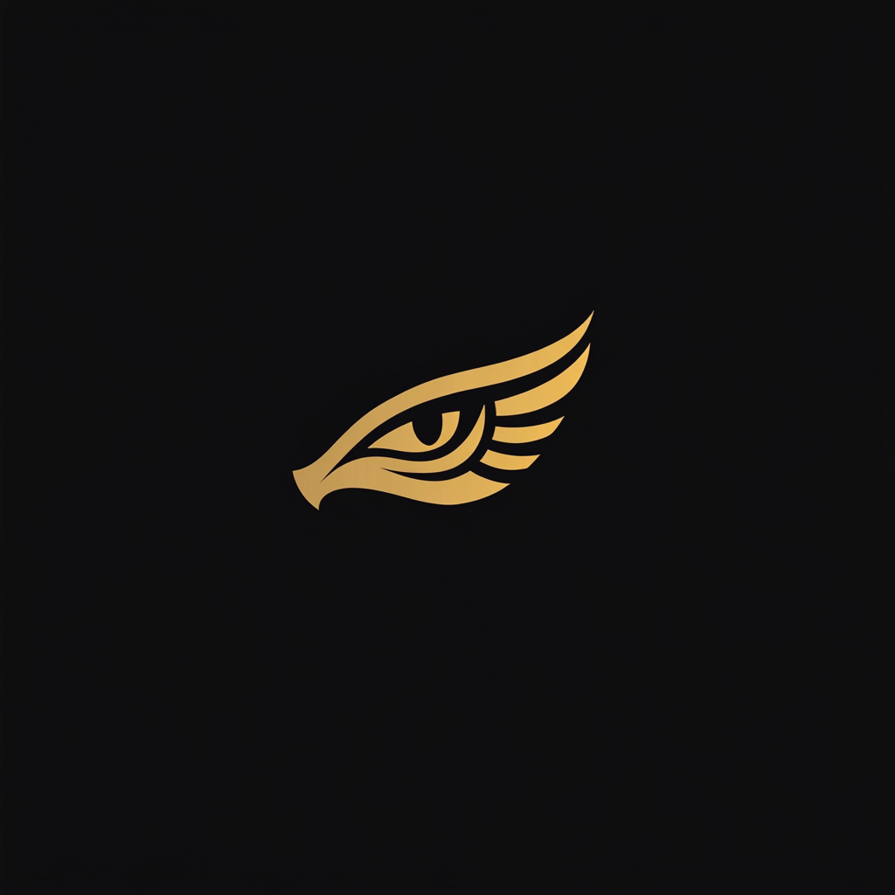

# Anubis 

<strong>AI Device Helping You Remember Your Best Memories</strong>

## Updates 

- September 1st, 2024: Just decided to add this section to the project. 
- September 1st, 2024: Bluetooth photo taking failed, working on it.
- September 5th, 2024: WiFi Connection tested and it works perfectly. 
- September 5th, 2024: Camera initialized correctly.
- November 25th, 2024: Camera code with the ability of being online uploaded to the board. 
- November 26th, 2024: API has been written and tested.
- November 26th, 2024: API edited for better image file names.
- November 26th, 2024: Minor modifications and tests has been done.

## Repository Guide

### Folders

- `notebooks`: Jupyter Notebooks including codes such as API connections and AI training/inference material.
- `arduino_codes` : Arduino experiments with the board.
    - `LED` : Experimenting with LED on Pin 4. It was just a basic test, and not even worth sharing.
    - `BLUETOOTH_LED` : Experimenting with bluetooth commands, turning the LED on or off using Bluetooth terminal.
    - `BLUETOOTH_CAMERA` : Experimenting with bluetooth and camera, failed miserably.
- `server` : A simple implementation of the API 
    - `main.py` : Just the code for API.

### Files 

- `mindmap.pdf` : Just how we thought about the project flow.

## What we need

- [x] ESP32 Cam Module (the exact model will be added soon)
- [x] A micro-USB cable

## The Software we need 

- [x] Google Account (Just for colab notebooks, must of the codes can be executed on a local CPU machine as well.)
- [x] An account on [Cloudflare](https://cloudflare.com)
- [x] An account on [OpenRouter](https://openrouter.ai)
- [x] Arduino IDE (Download from [Arduino](https://arduino.cc) website.)